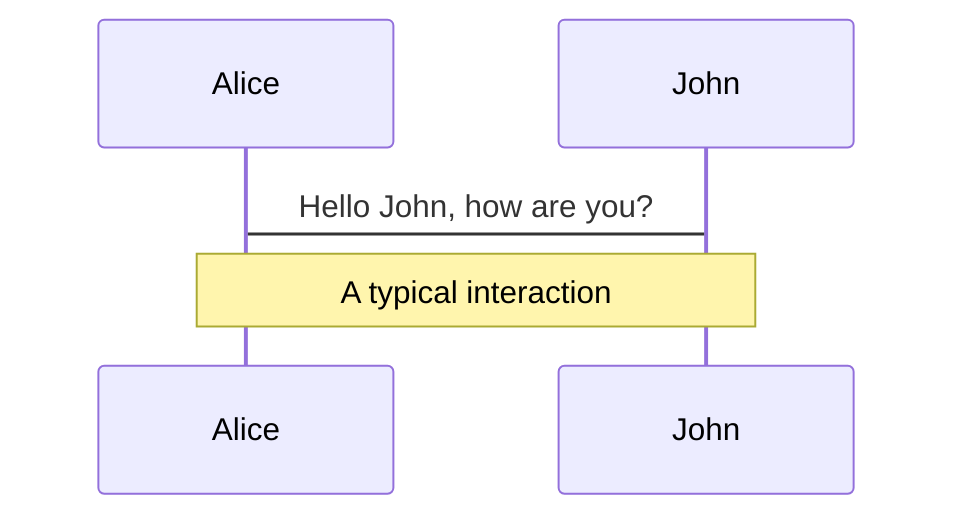
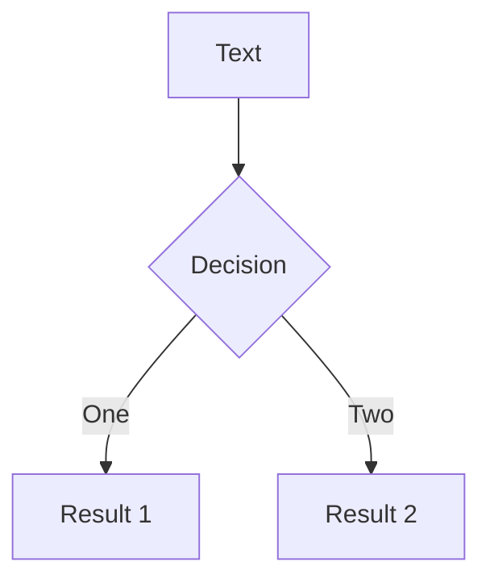

# 研究室ツール紹介
## Drone編

岩見彰太

### 武市研究室　M2
### 2021/05/20


---

# Agenda


2. ドローン業界図
   1. PX4
   2. DJI
3. 研究室で使用しているツール
   1. SITL
      1. Drone Kit
      2. Gazebo
      3. QGroud Control
      4. (ulog)
      5. (Flight Review)
  
<style>
h1 {
  background-color: #2B90B6;
  background-image: linear-gradient(45deg, #4EC5D4 10%, #146b8c 20%);
  background-size: 100%;
  -webkit-background-clip: text;
  -moz-background-clip: text;
  -webkit-text-fill-color: transparent; 
  -moz-text-fill-color: transparent;
}
</style>


---

# ドローン業界図

## 業界シェア


<br>

<!-- <div class="grid grid-cols-2 gap-2"> -->
<div class='flex mb-10'>

<div class="w-6/10">

- 中国の大手メーカー DJI がトップを独走
- しかし外交関係から、アメリカなどではDJIの機体を政府の利用するから完全に除外する制裁を発動
- 今後、DJI以外のメーカーからこの辺りの需要を突くような製品の開発が進んでいくと思われる
  - と、ずっと言われているがDJIの技術力が高すぎるためどこも追いつけない
- ENRIでもDJIのドローンの使用は禁止されたらしいので、日本でも政府系の利用は今後厳しいかもしれない
- 民間ではDJI機体は積極的に用いられている


</div>

<div class="w-4/10" m="-t-13">
<!-- <div m="-t-13"> -->
  
  
  ### 2021年3月現在アメリカのドローン市場

</div>

</div>


### [DRONEII、ドローンメーカーマーケットシェア2020 TOP10発表！中米紛争後の米国ドローン市場シェアはどうなった？](https://www.drone.jp/news/2021030811351043980.html)


---

# ドローン業界図


<div class="grid grid-cols-2 gap-2" m="-t-2">
<div>
  
  ## PX4
  
  - 世界で最も大きなOSS ドローンソフトウェア
  - 各社製品で、これをベースに自社開発しているプロダクトも多い（最近だとSONYとか）
  - かつて3D Ropbotics社が管理しており、その際に作られたラッパーライブラリも多い
	（以前使用した `drone-kit` はこれ）


  
  
</div>

<div>
  
  ## DJI
  - 世界最大手中国ドローンメーカー
  - テレビで空撮の映像が流れたら、100% DJI製
  - 実は元々ジンバルを作っていた会社
  - DJI SDK を利用可能な機体は、自分でカスタマイズできる（後述）


</div>


  
</div>


---
layout: image-left
image: https://shop.skylinkjapan.com/html/upload/save_image/0527121648_5ceb56a0be7e1.jpg
---


# Matrice 600

## 研究室で買った機体

<br>

- いくつかある DJI SDK の内 **Onbord SDK** が使える
  - シリアル接続により、直接フライトコントローラーと通信ができる
  - センサーのデータを自由に取れる
  - それを利用して飛行軌道の制御ができる
- 高い

---

# そもそも DJI SDK とは

- DJI製の機体を開発するためのキット
- それぞれ用途により分かれている
- 研究において（もし使うとしたら）関係あるのは Mobile SDK と Onbord SDK
  - Mobile SDK
    - RC で操作するAndroid or iOS アプリ開発用のSDK（Swift, Kotlin） 
    - サポートされているセンサーデータの取得や飛行指示などが利用できるはず
  - Onbord SDK
    - 機体に相乗りさせて利用する際に使用するSDK
    - Raspberry piなどのマイコンから何か操作する際に利用


---
layout: fact
---


# PX4

今まで研究室（自分）が利用してきたのはこっち


---

# 最終実装目標はこのSITLが回せること

<Youtube id="LXGnrjaE5Fg?t=98" class="h-100 w-full"/>


<style>
h1 {
  background-color: #2B90B6;
  background-image: linear-gradient(45deg, #4EC5D4 10%, #146b8c 20%);
  background-size: 100%;
  -webkit-background-clip: text;
  -moz-background-clip: text;
  -webkit-text-fill-color: transparent; 
  -moz-text-fill-color: transparent;
}
</style>

---


# 技術スタック

1. Drone Kit
   - Pythonのラッパーライブラリ
2. Gazebo
   - 3D シミュレーター（ ※ Windows では動きません）
3. QGroud Control
   - PX4 を制御・監視モニタリングする地上局ソフト
4. ulog
   - PX4 などのデバイスで使用される特殊な log ファイル
5. Flight Review
   - 即座にフライトログを確認できるWEB App

---


# SITLとは？

## Software in the Loop

<div class="grid grid-cols-2 gap-10" m="-t-2">

<div>

<br>

- ハードウェアなしで、機体の飛行をシミュレーションすること。
- 今回の場合は、シミュレーターで PX4 を起動して、そこに対して Gazebo で仮想環境（風や重力加速度等）を模擬して検証する
</div>
<div>
  
[](https://gyazo.com/a14a66adb75dca55990ef6e52220bcee)

</div>
</div>

---

# 環境構築（Mac OS の場合)

```py {all|1-2|4-7|9-10|0}
$ brew tap PX4/px4
$ brew install px4-dev

# install required packages using pip3
$ python3 -m pip install --user pyserial empy toml numpy pandas jinja2 pyyaml pyros-genmsg packaging
# if this fails with a permissions error, your Python install is in a system path - use this command instead:
$ sudo -H python3 -m pip install --user pyserial empy toml numpy pandas jinja2 pyyaml pyros-genmsg packaging

$ brew install --cask xquartz
$ brew install px4-sim-gazebo`

```

clone
sumodule が大量にあるので、--recursiveを忘れない

```py{0|1|0}
$ git clone https://github.com/PX4/PX4-Autopilot.git --recursive
```

シミュレーター実行

```py{0|all}
$ cd /path/to/PX4-Autopilot
$ make px4_sitl gazebo
```

---

# drone-kit の install 
### （これで、pythonで機体を操作できるようになる）


<div class="grid grid-cols-2 gap-10" m="-t-2">

<div>

作業ディレクトリで実行
自分の場合は、pyenvで仮想環境を作った
```py {all|1-3|5-6|8-9|11|all}
# $ python -m venv [newenvname]
# 名前はvenvにするのが無難
$ python -m venv venv

# activate
$ source [newenvname]/bin/activate

$ vi requirements.txt
# 右の記載をする

$ pip install -r requirements.txt


```

</div>

<div>

`requirements.txt`

```txt
flask
dronekit
dronekit-sitl
schedule
pyserial
pyulog
pandas
matplotlib
```


</div>


</div>


---

# 全体像


- あとは、localhost:14540 に対して **drone-kit** で接続すればいい
- 機体の操作は drone-kit のリファレンスを参照
- ここの通信は MavLink という特殊なプロトコルで行われているが、これをラッパーしたライブラリは実は Python 製以外も存在する（ex, Golang 製 の Gobot など）


---

# test

Presentation slides for developers
 
<div class="pt-12">
  <span @click="$slidev.nav.next" class="px-2 p-1 rounded cursor-pointer" hover="bg-white bg-opacity-10">
    Press Space for next page <carbon:arrow-right class="inline"/>
  </span>
</div>

<a href="https://github.com/slidevjs/slidev" target="_blank" alt="GitHub"
  class="abs-br m-6 text-xl icon-btn opacity-50 !border-none !hover:text-white">
  <carbon-logo-github />
</a>

<!--
The last comment block of each slide will be treated as slide notes. It will be visible and editable in Presenter Mode along with the slide. [Read more in the docs](https://sli.dev/guide/syntax.html#notes)
-->

---

# 自己紹介


こんにちは

- 📝 **Text-based** - focus on the content with Markdown, and then style them later
- 🎨 **Themable** - theme can be shared and used with npm packages
- 🧑‍💻 **Developer Friendly** - code highlighting, live coding with autocompletion
- 🤹 **Interactive** - embedding Vue components to enhance your expressions
- 🎥 **Recording** - built-in recording and camera view
- 📤 **Portable** - export into PDF, PNGs, or even a hostable SPA
- 🛠 **Hackable** - anything possible on a webpage

<br>
<br>

Read more about [Why Slidev?](https://sli.dev/guide/why)


<!--
You can have `style` tag in markdown to override the style for the current page.
Learn more: https://sli.dev/guide/syntax#embedded-styles
-->

<style>
h1 {
  background-color: #2B90B6;
  background-image: linear-gradient(45deg, #4EC5D4 10%, #146b8c 20%);
  background-size: 100%;
  -webkit-background-clip: text;
  -moz-background-clip: text;
  -webkit-text-fill-color: transparent; 
  -moz-text-fill-color: transparent;
}
</style>


---
layout: cover
---

# Slidev

This is the cover page.

---

# Page 2

This is a page with the layout `center` and a background image.

---
layout: cover
---

# Page 3

This is a default page without any additional metadata.


---

# Navigation

Hover on the bottom-left corner to see the navigation's controls panel, [learn more](https://sli.dev/guide/navigation.html)

### Keyboard Shortcuts

|     |     |
| --- | --- |
| <kbd>right</kbd> / <kbd>space</kbd>| next animation or slide |
| <kbd>left</kbd> | previous animation or slide |
| <kbd>up</kbd> | previous slide |
| <kbd>down</kbd> | next slide |


<p v-after class="absolute bottom-23 left-45 opacity-30 transform -rotate-10">Here!</p>

---
layout: image-right
image: https://source.unsplash.com/collection/94734566/1920x1080
---

# Code

Use code snippets and get the highlighting directly!

```ts {all|2-8|1-6|9|all}
interface User {
  id: number
  firstName: string
  lastName: string
  role: string
}

function updateUser(id: number, update: User) {
  const user = getUser(id)
  const newUser = {...user, ...update}  
  saveUser(id, newUser)
}
```

<arrow v-click="3" x1="400" y1="420" x2="230" y2="330" color="#564" width="3" arrowSize="1" />


---

# Components

<div grid="~ cols-2 gap-4">
<div>

You can use Vue components directly inside your slides.

We have provided a few built-in components like `<Tweet/>` and `<Youtube/>` that you can use directly use. And add your custom components are also super easy.

```html
<Counter :count="10" />
```

<!-- ./components/Counter.vue -->
<Counter :count="10" m="t-4" />

Check out [the guides](https://sli.dev/builtin/components.html) for more.

</div>
<div>

```html
<Tweet id="1390115482657726468" />
```

<Tweet id="1390115482657726468" scale="0.65" />

</div>
</div>


---
class: px-20
---

# Themes

Slidev comes with powerful theming support. Themes are able to provide styles, layouts, components, or even configurations for tools. Switching between themes by just **one edit** in your frontmatter:

<!-- <div grid="~ cols-2 gap-2" m="-t-2"> -->
<div class="grid grid-cols-2 gap-2" m="-t-2">

```yaml
---
theme: default
---
```

```yaml
---
theme: seriph
---
```


</div>

Read more about [How to use a theme](https://sli.dev/themes/use.html) and
check out the [Awesome Themes Gallery](https://sli.dev/themes/gallery.html).

---
preload: false
---

# Animations

Animations are powered by [@vueuse/motion](https://motion.vueuse.org/).

```html
<div
  v-motion
  :initial="{ x: -80 }"
  :enter="{ x: 0 }">
  Slidev
</div>
```

<div class="w-60 relative mt-6">
  <div class="relative w-40 h-40">
    
    
    
  </div>

  <div 
    class="text-5xl absolute top-14 left-40 text-[#2B90B6] -z-1"
    v-motion
    :initial="{ x: -80, opacity: 0}"
    :enter="{ x: 0, opacity: 1, transition: { delay: 2000, duration: 1000 } }">
    Slidev
  </div>
</div>

<!-- vue script setup scripts can be directly used in markdown, and will only affects current page -->
<script setup lang="ts">
const final = {
  x: 0,
  y: 0,
  rotate: 0,
  scale: 1,
  transition: {
    type: 'spring',
    damping: 10,
    stiffness: 20,
    mass: 2
  }
}
</script>

<div
  v-motion
  :initial="{ x:35, y: 40, opacity: 0}"
  :enter="{ y: 0, opacity: 1, transition: { delay: 3500 } }">

[Learn More](https://sli.dev/guide/animations.html#motion)

</div>

---

# LaTeX

LaTeX is supported out-of-box powered by [KaTeX](https://katex.org/).

<br>

Inline $\sqrt{3x-1}+(1+x)^2$

Block
$$
\begin{array}{c}

\nabla \times \vec{\mathbf{B}} -\, \frac1c\, \frac{\partial\vec{\mathbf{E}}}{\partial t} &
= \frac{4\pi}{c}\vec{\mathbf{j}}    \nabla \cdot \vec{\mathbf{E}} & = 4 \pi \rho \\

\nabla \times \vec{\mathbf{E}}\, +\, \frac1c\, \frac{\partial\vec{\mathbf{B}}}{\partial t} & = \vec{\mathbf{0}} \\

\nabla \cdot \vec{\mathbf{B}} & = 0

\end{array}
$$

<br>

[Learn more](https://sli.dev/guide/syntax#latex)

---

# Diagrams

You can create diagrams / graphs from textual descriptions, directly in your Markdown.

<div class="grid grid-cols-2 gap-4 pt-4 -mb-6">





</div>

[Learn More](https://sli.dev/guide/syntax.html#diagrams)


---
layout: center
class: text-center
---

# Learn More

[Documentations](https://sli.dev) / [GitHub Repo](https://github.com/slidevjs/slidev)
